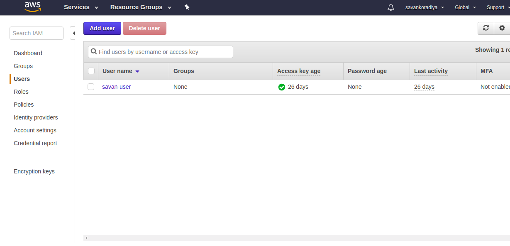

# Executing commands on EC2 using AWS Lambda

## About

Execute commands or scripts on Linux instances by using SSH and aws lambda when flie upload in s3 bucket.


### Create S3 Bucket

Open AWS Console and Select S3


Click on Create Bucket


Give it a name, select region then click next through each step


### Create Ubuntu 16.04 Instance


Open AWS Console and Select ec2


Click on Launch Instance


Select Ubuntu Server 16.04 


Choose an Instance Type and click next throught each step


### Create User and Roles

Open AWS Console and Select IAM


Click on users


Click on Add User



Add User name and check Programmatic access and click next and Click on create user


Reopen users and Click on Roles


Select Amazon services and lambda click next


Search lambda and check AWSLambdaExecute


Add Role Name and click create role


Click on Add inline policy 


Search DescribeInstances and  select DescribeInstances click on Review Policy


Add Name and click on Create Policy


## Create Lambda Package

## Install python 3.6 in your machine or ec2 instance

Install virualenv

```
pip3 install virtualenv

```
Create Virtualenv

```
virtualenv demo

```

Active your virtual environment

```
source demo/bin/activate

```

## Install Required Packages

```
pip3 install boto3
pip3 install paramiko

```

## Go to demo/lib/python3.6/site-packages

## Create zip file

```
zip -r code_lambda.zip .

```
## Add your Code Files

```
zip -r code_lambda.zip code_lambda.py

```
### Create Lambda

Open AWS Console and Select lambda


Click on Create Function


Click on Blueprints and search python3 you will find Hello-World-python3 select that


Add Name and Select Existing role which we create earlier and click on Create Function


Click on S3 


Select your Bucket

Add Prefix folder name where you storing your images in s3 bucket 

Add sufix like .jpg,.mp4 etc ..

Click on Create Function


Select Upload .zip file and Select zip file which we created earlier and click on save button


In Handle you need to add "your file name"."your function name"


Set Timeout according your code execution


Put your private/public Key inside "key" folder name on s3 bucket

Click on Test button


